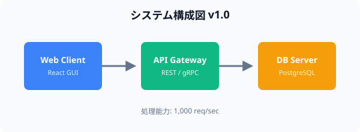

# 1. プロジェクト概要

本ドキュメントは、PDFビュワーにおける**自動差分検出機能**の初期仕様を定義するものです。
本システムは、ユーザーが指定した2つのPDFドキュメントを比較し、テキスト・段落構造・表・および図表（画像）の変更箇所を精密に判定してGUI上でハイライト表示します。

主な目的は、ドキュメントの改訂チェック作業を自動化し、見落としによる人的ミスを防止することです。既存のPDF比較ツールと比較して、より高速で直感的なUI/UXを提供します。

# 2. システム性能および動作仕様

以下に、バージョン1.0における基準パフォーマンス仕様を示します。

| 評価項目 | 仕様・基準値 | 備考 |
| :--- | :--- | :--- |
| 対応ファイル形式 | PDF (v1.4 - v2.0) | 標準ベクトル/テキストPDF |
| 最大比較ページ数 | 100 ページ | メモリ推奨 2GB |
| 平均処理速度 | 1.5 秒 / ページ | CPUシングルスレッド処理 |
| 差分検出精度 | 95.0 % | テキストおよび標準図表 |
| 対応動作環境 | macOS, Windows 11 | Linuxは実験的対応 |

# 3. システムアーキテクチャ

以下に、初期フェーズにおけるシステムコンポーネント構成図を示します。

# 4. 運用上の注意点と制限事項

1. 比較を行う前に、入力対象のPDFファイルが正常に開けるか確認してください。
2. 暗号化や保護が施されたPDFファイルは、あらかじめパスワードを解除してからインポートする必要があります。
3. 画像差分の比較においては、解像度の違いによる誤検出を防ぐため閾値設定を適切に行ってください。
