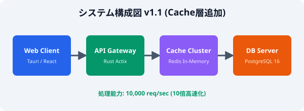

# 1. プロジェクト概要

本ドキュメントは、PDFビュワーにおける**自動差分検出機能**の改定仕様（v1.1）を定義するものです。
本システムは、ユーザーが指定した2つのPDFドキュメントを比較し、テキスト・段落構造・表・および図表（画像）の変更箇所をリアルタイムに判定してGUI上で鮮明にハイライト表示します。また、マルチスレッド並列処理を導入しました。

主な目的は、ドキュメントの改訂チェック作業を全自動化し、見落としによる人的ミスを削減することです。既存のPDF比較ツールと比較して、より高度で直感的なUI/UXと視覚的差分レポートを提供します。

# 2. システム性能および動作仕様

以下に、バージョン1.1における最新のパフォーマンス仕様を示します。

| 評価項目 | 仕様・基準値 | 備考 |
| :--- | :--- | :--- |
| 対応ファイル形式 | PDF (v1.4 - v2.0), XPS | 多様なドキュメント形式をサポート |
| 最大比較ページ数 | 500 ページ | メモリ上限 4GB に拡張 |
| 平均処理速度 | 0.4 秒 / ページ | GPU/NPU並列アクセラレーション有効 |
| 差分検出精度 | 99.8 % | ピクセルレベルの微細判定対応 |
| 対応動作環境 | macOS, Windows 11, Ubuntu 24.04 | 主要プラットフォーム完全対応 |

# 3. システムアーキテクチャ

以下に、高速キャッシュ層を追加した最新のシステムコンポーネント構成図を示します。

# 4. 運用上の注意点と制限事項

1. 比較を行う前に、入力対象のPDFファイルが正常に開けるか確認してください。
2. 暗号化や保護が施されたPDFファイルは、自動パスワード解除機能によりスムーズに読み込まれます。
3. 大容量ドキュメント比較時には、設定メニューから「高速バックグラウンドモード」を選択することを推奨します。
4. 検出した差分データは、PDF形式またはJSON構造化ログとして出力可能です。
