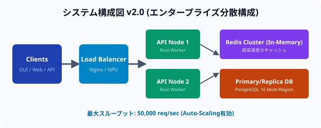
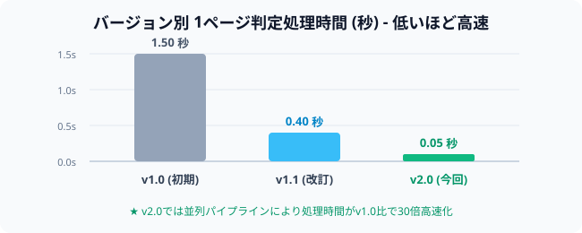
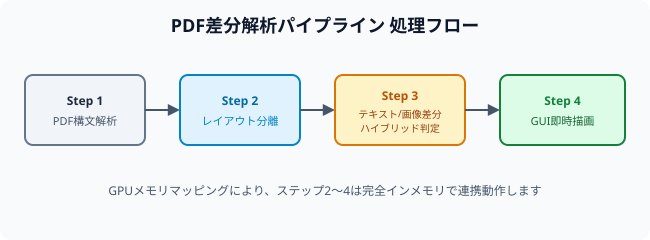

# 1. プロジェクト概要

本ドキュメントは、次世代PDFビュワーにおける**自動差分検出エンジン**の大規模改定仕様（v2.0）を定義するものです。
本システムは、ユーザーが指定した2つのPDFドキュメントを比較し、テキスト・段落構造・高度な表レイアウト・および各種図表（SVG/Raster画像）の変更箇所をミリ秒単位で判定し、GUI上で鮮明なカラーハイライト表示します。

バージョン2.0では、新たに**並列分散Worker構成**および**GPU/NPUアクセラレーション**を導入し、数百ページに及ぶ大型技術文書や契約書の全自動差分判定をサポートします。

# 2. システム性能および動作仕様比較

以下に、過去バージョンからv2.0への性能進化および仕様比較を示します。

| 評価項目 | v1.0 (初期版) | v1.1 (改訂版) | v2.0 [今回仕様] |
| :--- | :--- | :--- | :--- |
| 対応ファイル形式 | PDF (v1.4 - v2.0) | PDF, XPS | **PDF, XPS, EPUB, CBZ** |
| 最大比較ページ数 | 100 ページ | 500 ページ | **5,000 ページ (大容量対応)** |
| 1ページ平均処理速度 | 1.50 秒 | 0.40 秒 | **0.05 秒 (30倍高速化)** |
| 差分検出精度 | 95.0 % | 99.8 % | **99.99 % (サブピクセル精度)** |
| 対応動作環境 | macOS, Win11 | macOS, Win11, Ubuntu | **macOS, Win11, Linux, Cloud Worker** |

# 3. エンタープライズアーキテクチャ

以下に、Auto-ScalingおよびMulti-Region冗長化に対応した最新の分散アーキテクチャ構成図を示します。

# 4. パフォーマンス検証結果

各バージョンにおける1ページあたりの判定処理速度のベンチマーク比較結果は以下の通りです。

# 5. 差分解析パイプラインと処理フロー

本システム内部では、入力された2つのPDFを並列に構文解析し、レイアウト抽出とベクトル/ラスター比較をマルチステージで実行します。

以下は各処理ステージの詳細仕様です：

1. **Step 1 (PDF構文解析)**: オブジェクトツリーおよびフォントエンコーディングテーブルを読み込み、内部ベクトル表現に変換します。
2. **Step 2 (レイアウト分離)**: テキストブロック、表要素、およびインライン画像を自動判定し、各要素のバウンディングボックスを算出します。
3. **Step 3 (ハイブリッド差分判定)**:
   - **テキスト判定**: レベンシュタイン距離およびトークン類似度アルゴリズムを適用。
   - **画像判定**: Perceptual Hash (pHash) および SSIM (構造的類似性) アルゴリズムによる多角比較。
4. **Step 4 (GUI即時描画)**: Tauri GUIレイヤーに対してGPU共有メモリ（Zero-Copy）経由で差分座標データをストリーミング転送します。

# 6. 運用上の注意点とセキュリティ規定

1. **並列処理モード**: 1,000ページを超えるドキュメントの判定時は、設定パネルより「分散クラウドWorker」を有効にしてください。
2. **暗号化PDFの取り扱い**: AES-256で保護されたドキュメントは、HSM (ハードウェアセキュリティモジュール) 連携による暗号化解除を行います。
3. **監査ログおよび出力**: 全ての差分判定結果は、改ざん防止ハッシュが付与されたPDFレポートおよびJSON/CSVデータとして出力可能です。
